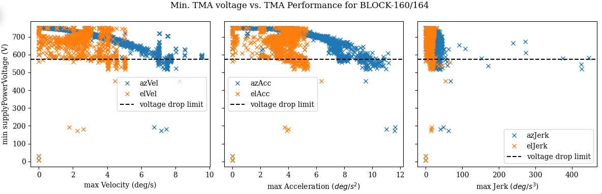
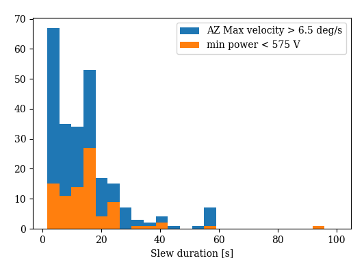

# TMA Performance Settings vs Capacitor Bank

```{abstract}
This tech note presents an analysis of the the maximum velocity, acceleration and jerk on every slew with the minimum value of the capacitor banks on the TMA. This is in support of [SITCOM-1146](https://jira.lsstcorp.org/browse/SITCOM-1146).

In addition, the tech note presents the analysis of the relationship between the current draw (rather than power supply voltage) and also how much power was in the banks prior to a large drop. This is in support of [SITCOM-1224](https://rubinobs.atlassian.net/browse/SITCOM-1224).
```

## Introduction
The contractor responsible for the TMA Power supply and capacitor banks, **_Phase_**, has indicated that it is best to keep the voltage drops during a slew to above 575 V. 
We looked at the data from several nights of testing in Dec. 2023 to evalute the relationship between the voltage drop during a slew and the performance of the TMA during that slew. 
The data analysed was taken as part of [BLOCK-160](https://jira.lsstcorp.org/browse/BLOCK-160) and [BLOCK-164](https://jira.lsstcorp.org/browse/BLOCK-164), covering tests performed December 11 - 15, 2023.

In this analysis, we identified each slew during these nights of observing using `TMAEventMaker()`.
Then we queried the EFD for data taken during those slews from the following topics
* `lsst.sal.MTMount.mainPowerSupply`
* `lsst.sal.MTMount.elevation`
* `lsst.sal.MTMount.azimuth` 

Using the method defined in [SITCOMTN-067](https://sitcomtn-067.lsst.io), we calculated the acceleration and jerk from the measured velocity and then found the maximum value during a slew. 

In this analysis, we compare the maximum values of the performance of the TMA to the minimum value recorded during the slew of the `powerSupplyVoltage` for the `mainPowerSupply`.

This analysis can be found at [https://github.com/lsst-sitcom/notebooks_vandv/tree/develop/notebooks/tel_and_site/subsys_req_ver/tma/SITCOMTN-110_TMA_Perf_vs_Capacitor_Banks.ipynb.
](https://github.com/lsst-sitcom/notebooks_vandv/blob/tickets/SITCOM-1146/notebooks/tel_and_site/subsys_req_ver/tma/SITCOMTN-110_TMA_Perf_vs_Capacitor_Banks.ipynb)

This technote has been extended with the analysis of the [SITCOM-1224](https://rubinobs.atlassian.net/browse/SITCOM-1224) ticket, where we have analysed how max power supply Current draw behaves with the distance, with the maximum speed, the maximum acceleration, the maximum jerk in the azimuth movement of each slew. 

In addition we have analysed discaharged energy, voltage, and current consumption over the azimuth velocity, acceleration, and jerk during each slew. In SITCOM-1224, we analyzed the nights from March 1, 2024, to March 5, 2024. In this report, we included the results from the night of 2024-03-01, as no significant differences were detected across any of the analyzed nights.

This analysis can be found at https://github.com/lsst-sitcom/notebooks_vandv/pull/130. Here, we show the results of  March 01, 2024.


## Results
### Overall
Here are the histograms for the data from all slews in BLOCK-160/164. There were ~1500 slews during those days of observation.


Then, we can look at the relationship between the power drops and the performance attributes overall, and on a day-by-day basis.




### Power drops less than 575 V
Now, we want to look at those slews in which the power did drop below 575V to understand under which circumstances this occurred.

It's clear that it occurs when the Azimuth velocity is higher than 6.5 deg/s with accelerations higher than 7.5 deg/s^2. However, it doesn't consistently occur every time this velocity/acceleration is reached.


Several possibilities were explored:
1. Is it a combination of the Azimuth and Elevation speed? 

It does seemt to be more likely when the Elevation velocity is above 3 deg/s, but still not a certainty.

2. Is it correlated to the duration of the slew?

That does not seemt to be the case.

3. Does it seem to correlated with the time of night or in what sequence it occured? 

There is no evidence for that.

### Relationship of max power supply Current draw and distance of slew
From here, we present the analysis of the night of March 1, 2024. We will investigate whether there is any relationship between the maximum power supply current draw and the distance of slew. 


We analyze both elevation and azimuth. As shown in the graphs, there does not appear to be a clear correlation. In both cases, the maximum current draw never exceeds 45 A.

### Look at Azimuth acceleration vs. power supply current


The maximum power supply current appears to begin increasing when the TMA reaches azimuth velocity close to 1.5 deg/s, peaking at speeds of 4 deg/s. Regarding acceleration, the maximum power supply current starts to increase at accelerations greater than 2.5 deg/s².


### Look at Azimuth acceleration vs. Total Discharged Energy
The total discharged energy increases with speed and acceleration. We can observe some cases of low speed and low acceleration where there is a higher energy discharge. These specific cases should be further studied, as well as a single instance where the discharged energy exceeds 2.5J.


### Analysis of Energy (Discharged Energy, Voltage, and Current draw) During Slews
In the following plots, we have shown how a single slew (in this case, slew 4) behaves, and we have compared how the discharged energy (in red), the supply power voltage (in green), and the supply power current (in yellow) vary with velocity, acceleration, and jerk (in blue). 

As we can see in the upper plots, energy is discharged as velocity increases and continues to discharge even when velocity remains stable. When comparing with acceleration, we can observe that the greatest energy discharge occurs while the telescope is accelerating. When the telescope decelerates, it regains a small amount of energy. Regarding the supply voltage, we can see a clear relationship with acceleration: it decreases as the telescope accelerates and returns to zero when the rotation is no longer accelerating. The same behavior can be observed with the supply power current.


