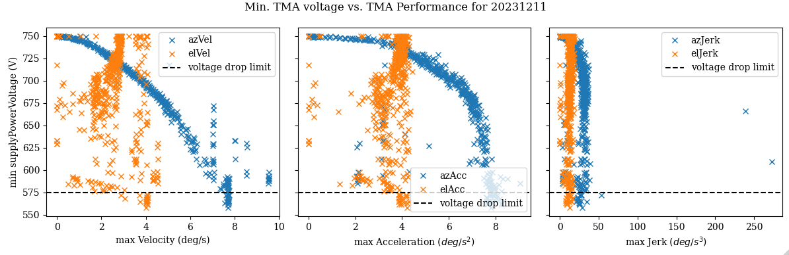
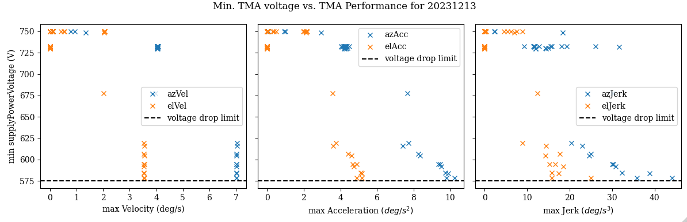
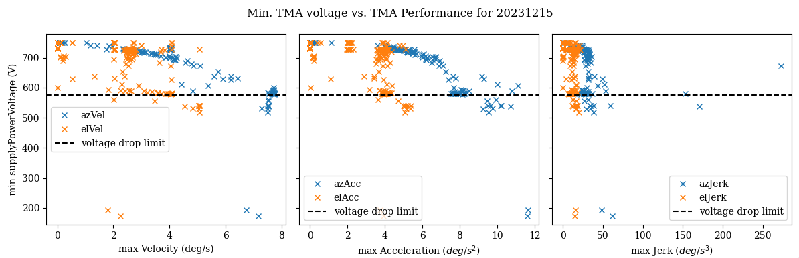
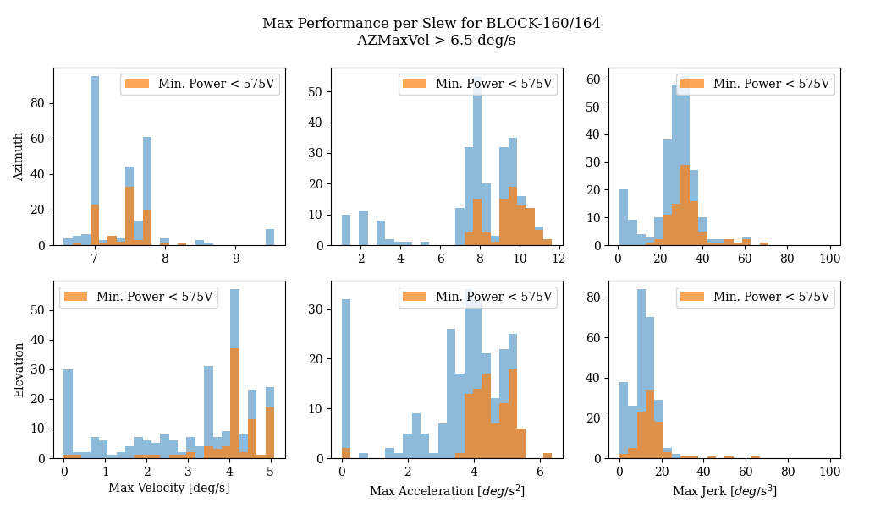

# TMA Performance Settings vs Capacitor Bank

```{abstract}
This tech note presents an analysis of the the maximum velocity, acceleration and jerk on every slew with the minimum value of the capacitor banks on the TMA. This is in support of [SITCOM-1146](https://jira.lsstcorp.org/browse/SITCOM-1146).
```

## Introduction
The contractor responsible for the TMA Power supply and capacitor banks, **_Phase_**, has indicated that it is best to keep the voltage drops during a slew to above 575 V. 
We looked at the data from several nights of testing in Dec. 2023 to evalute the relationship between the voltage drop during a slew and the performance of the TMA during that slew. 
The data analysed was taken as part of [BLOCK-160](https://jira.lsstcorp.org/browse/BLOCK-160) and [BLOCK-164](https://jira.lsstcorp.org/browse/BLOCK-164), covering tests performed December 11 - 15, 2023.

In this analysis, we identified each slew during these nights of observing using `TMAEventMaker()`.
Then we queried the EFD for data taken during those slews from the following topics
* `lsst.sal.MTMount.mainPowerSupply`
* `lsst.sal.MTMount.elevation`
* `lsst.sal.MTMount.azimuth` 

Using the method defined in [SITCOMTN-067](https://sitcomtn-067.lsst.io), we calculated the acceleration and jerk from the measured velocity and then found the maximum value during a slew. 

This analysis can be found at https://github.com/lsst-sitcom/notebooks_vandv/tree/develop/notebooks/tel_and_site/subsys_req_ver/tma/SITCOMTN-110_TMA_Perf_vs_Capacitor_Banks.ipynb.


## Results
### Overall
Here are the histograms for the data from all slews in BLOCK-160/164. There were ~1500 slews during those days of observation.


Then, we can look at the relationship between the power drops and the performance attributes overall, and on a day-by-day basis.








### Power drops less than 575 V
Now, we want to look at those slews in which the power did drop below 575V to understand under which circumstances this occurred.

It's clear that it occurs when the Azimuth velocity is higher than 6.5 m/s with accelerations higher than 7.5 m/s^2. However, it doesn't consistently occur every time this velocity/acceleration is reached.


Several possibilities were explored:
1. Is it a combination of the Azimuth and Elevation speed? 

It does seemt to be more likely when the Elevation velocity is above 3 m/s, but still not a certainty.

2. Is it correlated to the duration of the slew?

That does not seemt to be the case.

3. Does it seem to correlated with the time of night or in what sequence it occured? 

There is no evidence for that.

